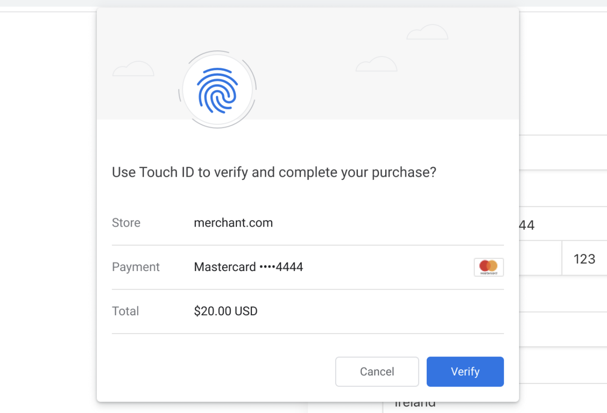

# Secure Payment Confirmation

Using FIDO-based authentication to securely confirm payments initiated via the Payment Request API.

This work is currently in incubation within [W3C Web Payments Working Group](https://www.w3.org/Payments/WG/).

Links:

- [Explainer](explainer.md)
- [Specification](https://w3c.github.io/secure-payment-confirmation/) ([spec.bs](spec.bs))

## FAQ

### Q. Who can validate the SPC response besides the actual Relying Party (RP)?

An SPC challenge bundles transaction details with transaction-specific dynamic data from the Relying Party. An SPC response includes a signature over that challenge. Validation in SPC refers to the verification of that signature using the credential public key. A Relying Party can choose to share the credential public key with another party (e.g., a card network or payment service provider) via out-of-band communication to enable that party to validate the SPC assertion.

## Acknowledgements

Contributors:

* Adrian Hope-Bailie (Coil)
* Benjamin Tidor (Stripe)
* Danyao Wang (Google)
* Christian Brand (Google)
* Rouslan Solomakhin (Google)
* Nick Burris (Google)
* Gerhard Oosthuizen (Entersekt)
