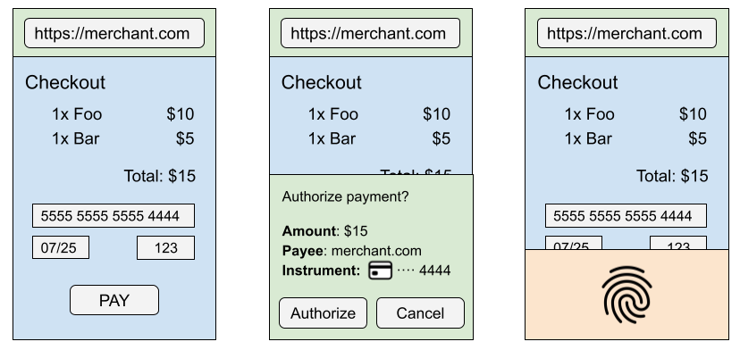

# Secure Payment Confirmation explained

## tl;dr

**Secure Payment Confirmation (SPC)** is a proposed Web API to support
streamlined authentication during a payment transaction. It is designed to
scale authentication across merchants, to be used within a wide range of
authentication protocols, and to produce cryptographic evidence that the user
has confirmed transaction details.

SPC adds payment-specific capabilities atop [WebAuthn] and is designed with
stronger privacy protections than risk analysis approaches that rely on data
collection.

See also:
  - [Specification](https://w3c.github.io/secure-payment-confirmation/), the formal draft spec.
  - [Scope document](https://github.com/w3c/secure-payment-confirmation/blob/main/scope.md)
  - [Requirements document](https://github.com/w3c/secure-payment-confirmation/blob/main/requirements.md)

<!-- START doctoc generated TOC please keep comment here to allow auto update -->
<!-- DON'T EDIT THIS SECTION, INSTEAD RE-RUN doctoc TO UPDATE -->
## Contents

- [Motivation](#motivation)
  - [Goals](#goals)
  - [Non-Goals](#non-goals)
- [Proposed Solution: Secure Payment Confirmation](#proposed-solution-secure-payment-confirmation)
  - [Proposed APIs](#proposed-apis)
    - [Creating a credential](#creating-a-credential)
      - [Creating a SPC credential in a cross-origin iframe](#creating-a-spc-credential-in-a-cross-origin-iframe)
    - [Authenticating a payment](#authenticating-a-payment)
    - [User Experience in Failure Modes](#user-experience-in-failure-modes)    
- [Other Considerations](#other-considerations)
  - [Initial Experimentation with Stripe](#initial-experimentation-with-stripe)
  - [Should SPC credentials be identical to WebAuthn credentials?](#should-spc-credentials-be-identical-to-webauthn-credentials)
  - [Why use the Payment Request API?](#why-use-the-payment-request-api)
- [Alternatives Considered](#alternatives-considered)
  - [Traditional WebAuthn](#traditional-webauthn)
  - [Delegated Authentication](#delegated-authentication)
- [Security Considerations](#security-considerations)
  - [Cross-origin authentication ceremony](#cross-origin-authentication-ceremony)
  - [Merchant-supplied authentication data](#merchant-supplied-authentication-data)
- [Privacy Considerations](#privacy-considerations)
  - [Enrollment in cross-origin iframes](#enrollment-in-cross-origin-iframes)
  - [Probing for credential IDs](#probing-for-credential-ids)
  - [Joining different payment instruments](#joining-different-payment-instruments)
  - [Credential ID(s) as a tracking vector](#credential-ids-as-a-tracking-vector)

<!-- END doctoc generated TOC please keep comment here to allow auto update -->

## Motivation

Online payments are usually a 3 party interaction:

* The Merchant (e.g. an online web store)
* The Customer (e.g. the user buying from an online web store)
* The Account Provider (e.g. the bank that issued the payment instrument being used)

> **NOTE**: It is not uncommon for there to be a fourth party: the Payment
> Service Provider, to whom the Merchant delegates the task of accepting the
> payment method. This is usually done by the Merchant either redirecting the
> User to the Payment Service Provider's website, or by embedding the Payment
> Service Provider in an iframe. Any following mention of the term Merchant
> should be taken to mean either a Merchant or a Payment Service Provider;
> whichever is handling payment.

Traditionally, the Customer only interacts with the Merchant, and the Merchant
communicates with the Account Provider via a back-channel protocol. However,
Account Providers are increasingly looking to authenticate Customers during
online payments. This is done for both regulatory reasons (e.g. [SCA] in the
European Union) and for fraud prevention reasons - either fradulent Customers or
fradulent Merchants.

Existing methods of authenticating a Customer during an online payment are
either high friction (e.g. embedding challenge iframes from the Account
Provider or redirecting to the Account Provider site or app) or have poor user
privacy (e.g. data-collection or tracking the user for risk analysis, to
provide a 'frictionless flow'). The payments industry needs a consistent, low
friction, strong authentication flow for online payments.

The [Web Authentication (WebAuthn) API][webauthn] makes FIDO-based
authentication available on the web, which provides a strong, low-friction
method for a user to prove a pre-established identity with a given site.
However, WebAuthn is not immediately suitable to solve the payments
authentication problem, as:

1. It requires the Account Provider to be present in the transaction (e.g. via
   an embedded iframe), which increases user friction and lowers conversion
   rates.
1. The generated assertion contains no payments-related information, so it
   cannot be used as-is to fulfill regulatory requirements to provide evidence
   of user consent (e.g. [Dynamic Linking] requirements).
1. WebAuthn does not allow credential creation in a cross-origin iframe, thus
   excluding a useful onboarding flow - registering a Customer after they have
   completed a traditional authentication flow (e.g. via SMS OTP), without
   the friction of redirecting them to the bank's site or app.

This proposal attempts to provide an authentication solution for online
payments that is both as strong and low-friction as WebAuthn, whilst also
solving these three issues.

<!-- TODO: Incorporate https://lists.w3.org/Archives/Public/public-webauthn-pay/2020Jan/0002.html as evidence of iframe friction -->

### Goals

Find a solution that (in no particular order):

* Has as-strong or stronger authentication than current challenge flows.
* Is less friction for the Customer than current challenge flows.
* Is more protective of user-privacy than current frictionless flows.
* Improves the ability for online payments to meet regulations such as [Dynamic
  Linking].

> **NOTE**: It is out-of-scope for the specification to **prove** adherence
> to e.g. Dynamic Linking, but we aim to produce a solution that could be
> vetted as such.

* Allows for in-flow registration of Customers during a traditional challenge
  flow, as well as outside of a transaction.

### Non-Goals

* Selection of a Payment Instrument by the Customer; it is presumed that the
  Customer has already done so (e.g. by typing in their credit card number).
* ID & V to establish real world identity during registration; it is up to the
  Account Provider to determine the Customer's identity to their satisfaction.
* Providing authentication for peer-to-peer or business-to-business
  transactions.
    * We expect that Secure Payment Confirmation may be useful in these
      cases, but are concentrating on consumer-to-business cases for now.

## Proposed Solution: Secure Payment Confirmation

Secure Payment Confirmation (SPC) builds on top of [WebAuthn] to add
payment-specific data to the signed assertion, and to relax assumptions to
allow the API to be called in payment contexts.

<div align="center">

|  |
|:--:|
| *Diagram: A payment flow authenticated by SPC. With SPC, the user does not leave the merchant website (in blue). The browser (in green) displays the merchant origin and provides a transaction confirmation dialog. The operating system (in orange) provides the biometric authentication service.* |

</div>

Ideally with Secure Payment Confirmation, a Customer would register once on a
given device for a given account with an Account Provider, either on the
Account Provider's website or during a traditionally-authenticated online
payment (e.g. after completing a challenge in an Account Provider iframe). Then,
in subsequent transactions on **any Merchant** that wishes to use Secure
Payment Confirmation:

1. The Customer selects a payment instrument (e.g. a credit card or bank
   account).
1. Using a back-channel (e.g. the EMV® 3-D Secure protocol), the Merchant asks
   for, and receives, a list of credentials for the identified Customer from
   the Account Provider.
1. **SPC API STARTS HERE.** The Merchant calls the SPC API with the list of
   [webauthn-credentials|credentials].
1. The User Agent displays a UX to the Customer, informing them of the
   transaction details and asking if they wish to authenticate their identity to
   the Account Provider.
1. The Customer consents, and the User Agent and Customer perform a [WebAuthn]
   signing ceremony. Payment details are included in the returned assertion.
1. The Merchant receives the assertion. **SPC API ENDS HERE.**
1. Using the existing back-channel, the Merchant sends the assertion to the Account Provider.
1. The Account Provider verifies the signature on the assertion, and verifies
   that the data in the assertion (e.g. transaction amount, payee) is as
   expected.
1. The Account Provider informs the Merchant of transaction success, and the
   payment concludes successfully.

> **NOTE**: Most of the above flow happens in the background. The user
> experience consists only of examining and agreeing to the transaction
> details, and performing a [WebAuthn] interaction.

For the handling of cases when no returned credentials match the current
device, see [the Privacy section](#privacy-considerations).

### Proposed APIs

Secure Payment Confirmation introduces a new [WebAuthn extension], `payment`,
which adds three payments-specific capabilities on top of traditional WebAuthn:

1. Allows calling `navigator.credentials.create` in a cross-origin iframe, as long
   as a ["payment" permission policy] is set on the iframe.
1. Allows a third-party (the Merchant) to initiate an authentication ceremony
   **on behalf of** the Relying Party (the Account Provider), by passing in
   credentials (typically provided to the Merchant by the Account Provider).
1. Enforces that the User Agent appropriately communicates to the user that they
   are authenticating a transaction and the transaction details. Those details
   are then included in the assertion signed by the authenticator.

> **NOTE**: Allowing `navigator.credentials.create` in a cross-origin iframe is
> [currently a topic of discussion](https://github.com/w3c/webauthn/issues/1656)
> in the WebAuthn WG too.

> **NOTE**: It is currently undecided whether an SPC credential should be
> explicitly different from a WebAuthn credential (e.g. by adding a new 'SPC
> bit' of some form), or whether existing WebAuthn credentials should be able
> to be used in SPC authentication. See **TODO**: link or file issue.

#### Creating a credential

Creating a credential in Secure Payment Confirmation is done by the same
`navigator.credentials.create` call as with [WebAuthn], but with a `payment`
extension specified.

```javascript
const publicKey = {
  challenge: Uint8Array.from(
      randomStringFromServer, c => c.charCodeAt(0)),

  rp: {
    name: "Fancy Bank",
  },

  user: {
    id: Uint8Array.from(userId, c => c.charCodeAt(0)),
    name: "jane.doe@example.org",
    displayName: "Jane Doe",
  },

  pubKeyCredParams: [
    {
      type: "public-key",
      alg: -7 // "ES256"
    },
    {
      type: "public-key",
      alg: -257 // "RS256"
    }
  ],

  authenticatorSelection: {
    userVerification: "required",
    residentKey: "required",
    authenticatorAttachment: "platform",
  },

  timeout: 60000,  // 1 minute

  extensions: {
    payment: {
      isPayment: true,
    },
  },
};

navigator.credentials.create({ publicKey })
  .then(function (newCredentialInfo) {
    // Send new credential info to server for verification and registration.
  }).catch(function (err) {
    // No acceptable authenticator or user refused consent. Handle appropriately.
  });
```

As per the above note, the need to have a special registration (formerly "enrollment") flow for SPC will
depend on whether:

* [WebAuthn] starts to allow credential creation in a cross-origin iframe.
* If it is considered reasonable for 'vanilla' WebAuthn credentials to be used
   in SPC authentication.

If both of these become true, then the extension would not be needed during
registration.

##### Creating a SPC credential in a cross-origin iframe

Unlike normal WebAuthn credentials, SPC allows a credential to be created in a
cross-origin iframe (e.g. if `merchant.com` embeds an iframe from `bank.com`). This is
intended to support the common registration flow of a bank registering the user during a
step-up challenge (e.g. after proving their identity via OTP).

To allow this, the cross-origin iframe must have the ["payment" permission
policy] set. For example:

```html
<!-- Assume parent origin is merchant.com -->
<!-- Inside this cross-origin iframe, script would be allowed to create a SPC credential for example.org -->
<iframe src="https://example.org" allow="payment">
```

#### Authenticating a payment

An origin may invoke the [Payment Request API] with the
`secure-payment-confirmation` payment method to prompt the user to verify a
Secure Payment Confirmation credential created by any other origin. The User
Agent will display a native user interface with transaction details (e.g. the
payment amount and the payee origin).

> **NOTE**: The `PaymentRequest.show()` method requires a user gesture. The User
> Agent will display a native user interface with the payment amount and the
> payee origin.

> **NOTE**: [Per the Payment Request specification][pr-cross-origin], if
> `PaymentRequest` is used within a cross-origin iframe (e.g. if `merchant.com`
> embeds an iframe from `psp.com`, and `psp.com` wishes to use
> `PaymentRequest`), that iframe must have the ["payment" permission policy]
> set.

Proposed new `secure-payment-confirmation` payment method:

```javascript
const request = new PaymentRequest([{
  supportedMethods: "secure-payment-confirmation",
  data: {
    // List of credential IDs obtained from the Account Provider.
    credentialIds,

    // The challenge is also obtained from the Account Provider.
    challenge: new Uint8Array(
        randomStringFromServer, c => c.charCodeAt(0)),

    instrument: {
      displayName: "Fancy Card ****1234",
      icon: "https://fancybank.com/card-art.png",
    },

    payeeOrigin: "https://merchant.com",

    timeout: 60000,  // 1 minute
  }], {
    total: {
      label: "Total",
      amount: {
        currency: "USD",
        value: "5.00",
      },
    },
  });

try {
  // NOTE: canMakePayment() checks only public information for whether the SPC
  // call is valid. To preserve user privacy, it does not check whether any
  // passed credentials match the current device.
  const canMakePayment = await request.canMakePayment();
  if (!canMakePayment) { throw new Error('Cannot make payment'); }

  const response = await request.show();
  await response.complete('success');

  // response.details is a PublicKeyCredential, with a clientDataJSON that
  // contains the transaction data for verification by the issuing bank.

  /* send response.details to the issuing bank for verification */
} catch (err) {
  /* SPC cannot be used; merchant should fallback to traditional flows */
}
```
## User Experience in Failure Modes

As the diagram above illustrates, the SPC "happy path" involves presentation of a transaction confirmation dialog followed by biometric authentication via the underlying platform.

Below are different failure modes and the corresponding expected user experience.

### No Available Authenticator

When the credential IDs provided as input do not match an available authenticator, the browser:

* displays a notice to the user, then
* returns an error message to the caller ("NotAllowedError").

### User Cancels Transaction Confirmation

When the user cancels the transaction confirmation dialog, the browser:

* returns an error message to the caller ("NotAllowedError").

### User Cancels Authentication Prompt

When the user cancels the underlying platform prompt to authenticate, the browser:

* returns an error message to the caller ("NotAllowedError").

### User Fails to Authenticate

When the user fails to authenticate, the underlying platform behavior will typically involve providing multiple opportunities to retry. If the authenticator signals failure to the browser, the browser will return an error message to the caller.

### Other Failure Scenarios

The Web Authentication algorithm [Use an Existing Credential to Make an Assertion](https://www.w3.org/TR/webauthn-3/#sctn-getAssertion) describes additional failure modes. SPC passes messages on to the caller.

## Other Considerations

### Initial Experimentation with Stripe

In late 2020, [Stripe] ran a 3-month experiment of Secure Payment Confirmation
via a Google Chrome [Origin Trial]. The experiment showed a **+8pp increase in
conversion rate** (~84.7% to 92.7%), a **3x reduction in time-to-authenticate**
(36s median to 12s median), and **neglible fraud**.

It is worth noting that the experiment only compared traditional One Time
Password challenge flows versus FIDO-based (e.g. biometric) challenge flows. No
comparison was done of WebAuthn versus Secure Payment Confirmation.

More details:
  - [Web Payments WG blog-post on the experiment](https://www.w3.org/blog/wpwg/2021/03/26/secure-payment-confirmation-stripe-experiment-and-next-steps/)
  - [Stripe presentation](https://www.w3.org/2021/Talks/spc-pilot-202103.pdf)

### Should SPC credentials be identical to WebAuthn credentials?

We have not yet reached a conclusion about whether a SPC credential should be
(somehow) marked as different from 'normal' WebAuthn credentials. It seems
reasonable that an SPC credential should be able to be used as a login
credential, if a Relying Party wished to do so. However whether a WebAuthn
credential should be able to used in a payment authentication context is less
clear.

Allowing such a use would make it easier for an entity with existing WebAuthn
credentials to use SPC, without requiring some explicit upgrade path. For
example, an Account Provider may already have created WebAuthn credentials for their
Customers to login, and might then want to use them for payment authentication
as well.

On the other hand, it would also open [a possible
attack](#cross-origin-authentication-ceremony) on Relying Parties who do not
perform sufficient verification of assertions that they receive. If a Relying
Party fails to check the `clientDataJSON.type` or `clientDataJSON.origin` of
the assertion, they might mistake a 3p-created SPC assertion for a login
assertion.

### Why use the Payment Request API?

The proposed Secure Payment Confirmation API is built on top of the [Payment
Request API] for authentication, defining SPC as a new 'payment method'. This
was largely done for ease of implementation in Chrome, and for lack of any
clearly better alternative.

Using Payment Request does have some drawbacks:

1. It has been argued that SPC does not make sense as a payment *method*, as
   it conducts no actual payment. (However note that basic-card is also a
   payment method and also conducts no actual payment - it only provides
   instrument selection).

1. There is a mismatch in API shape between the Payment Request API and SPC:
     * Payment Request assumes that many payment methods can be passed in, but
       SPC only makes sense on its own.
     * Payment Request assumes that a Payment Handler window is still showing
       after the `show()` promise resolves, and so has methods like `retry()`
       and `complete()` on the `PaymentResponse`. For SPC, if the `show()`
       promise resolves successfully there is nothing to retry or complete.

Suggestions have been made to instead use `navigator.credentials.get()` as the
entry point for SPC authentication. This seems reasonable but will require more
cooperation with the WebAuthn WG.

Related issues:
* https://github.com/w3c/secure-payment-confirmation/issues/65
* https://github.com/w3c/secure-payment-confirmation/issues/56

## Alternatives Considered

### Traditional WebAuthn

WebAuthn level 2 (which allows `navigator.credentials.get` in a cross-origin
iframe) does allow bringing FIDO-based authentication into online payments, by
letting the Account Provider utilize it in a challenge iframe (instead of e.g.
SMS OTP). However, as noted above, it is unable to support the following useful
payments-specific abilities:

1. Including displayed transaction information in the signed assertion, which
   can be used for regulations such as [Dynamic Linking].
1. Creating credentials during a payment flow, via credential creation in a
   cross-origin iframe.

Additionally, the Web Payments Working Group [has
heard](https://lists.w3.org/Archives/Public/public-webauthn-pay/2020Jan/0002.html)
that Merchants prefer not to have the Account Provider in the flow if possible,
as:

* It causes increased friction and lowered conversion rates, as users are
  disoriented by the bank iframe appearing, loading, etc.
* Including an iframe requires punching a hole in the merchant's CSP policy to
  allow every individual bank to be loaded
* Merchants have seen problems with the availability of internet-facing services
  from Account Providers - they are often the target for DOS attacks, for
  example.

SPC addresses each of these points as well.

### Delegated Authentication

A previous attempt that explored [delegated authentication] from the bank to
*specific* 3rd parties did not scale to the tens of thousands of online
merchants that accept credit cards.

## Security Considerations

On top of the [WebAuthn security considerations], there are a few
considerations specific to this proposal.

### Cross-origin authentication ceremony

One of the features that SPC adds is the ability for a third-party (the
Merchant) to utilize credentials provided by the Relying Party (the Account
Provider), to provide low-friction authentication for payments. This can
expose the Relying Party to both login and payment attacks.

**Login attack**

In this attack, a malicious third-party uses SPC (with some previously-obtained
credentials for an identified user, either legimitately or illicitly) to obtain
a payment assertion. They then send that assertion to the Relying Party's
**login** end-point, and hope that the Relying Party does not follow the
[WebAuthn requirements on assertion verification][webauthn-verification].

SPC does make sure that payment assertions differ from login assertions, in the
following ways:

1. The CollectedClientData `type` member is "payment.get", not "webauthn.get"
1. The CollectedClientData `origin` member will be the calling origin, which
     would **not** be the Relying Party in such an attack.
1. The CollectedClientData will also have an additional `payment` member for
     an SPC-generated assertion.

In addition to the above, a Relying Party should also record what type of
interaction (i.e. login or payment) a given `challenge` is generated for and
ensure that the use of the assertion matches the expected interaction type.

**Payment attack**

In this attack, a malicious third-party tries to use SPC (again with either
legimitately or illictly obtained credentials) to initiate an unauthorized
payment. Such an attack has a low chance of success for several reasons:

* When the attacker initiates SPC, the user will be shown an interface by the
    User Agent that clearly states the transaction details (including the payee
    and amount). The user is very likely to reject this interface as invalid.
* If the user does agree to the transaction, and completes the subsequent
    WebAuthn authentication ceremony, the attacker now has a signed SPC
    assertion for the Relying Party.
* If the Relying Party is not expecting a transaction, it will reject the
    assertion.
* If the Relying Party is expecting a transaction, it will detect an
    unfamiliar `challenge` and reject the assertion.

The general concept is that a Secure Payment Confirmation assertion is
essentially useless unless it is part of an ongoing online transaction.

### Merchant-supplied authentication data

In this attack, a malicious Merchant attempts to trick the Customer or Account
Provider into agreeing to a different transaction than they are actually
entering into, by passing in spoof values to the SPC API call. The Merchant is
able to influence the:

* Transaction amount and currency
* Payment instrument name and icon
* Payee origin

For example, the Merchant could tell the Account Provider (in the backend) that
it is initiating a purchase of $100, but then pass $1 to the SPC API (and thus
show the Customer a $1 transaction to verify).

This form of attack already exists on the web today (where an Account Provider
largely has to trust that the Merchant is showing the correct details). We
anticipate that SPC will provide better protection against this attack when
used according to this common pattern:

* The Merchant provides some "pre-authentication" transaction information
  (including merchant name and amount) to the Account Provider over a backend
  protocol.
* After receiving an assertion, the Account Provider can (and should) compare
  the pre-authentication details with the assertion details to ensure that they
  align.

## Privacy Considerations

On top of the [WebAuthn privacy considerations], there are a few considerations
specific to this proposal.

### Enrollment in cross-origin iframes

SPC allows the creation of credentials in a cross-origin iframe (as long as the
appropriate Permission Policy is set on the iframe). That is, if site A embeds
an iframe from site B, with the `"payment"` policy set, then site B may
initiate a credential creation for site B within that iframe.

A [previously described
attack](https://github.com/w3c/webauthn/issues/1336#issue-513568855) on this
exists, which leads to a tracking vector. The attack does presume script access
by the malicious party on the main frame and also the ability to trick a user
into (regularly) completing a WebAuthn interaction, but it is feasible.

One possible mitigation might be to require a transient user activation for
credential creation in a cross-origin iframe. This may still not suffice if the
malicious party has root-frame script access, as it could - for example -
overlay a transparent iframe on-top of a legitimate button.

### Probing for credential IDs

[As with WebAuthn][webauthn-auth-ceremony-privacy], SPC must take care not to
leak the existence of a credential (e.g. not differentiate between a credential
not matching versus the user declining to use it). The potential privacy leak
is worse than WebAuthn, as a third-party can now perform the attack rather than
just the Relying Party, but a conforming implementation should be able to avoid
leaks.

### Joining different payment instruments

There is a risk that malicious Merchants (either alone or colluding) could
manage to join information about payment instruments that might otherwise not
be linked. That is, across two different transactions that a user U performs
with payment instruments P1 and P2 (either on the same merchant M, or two
colluding merchants M1 and M2), the merchant(s) may now be able to learn that
P1 and P2 are for the same user.

For many current online payment flows this may not be a significant concern, as
the user already provides sufficient information to do this joining anyway
(e.g. their address), however it could become a privacy attack if, e.g.,
payment tokenization becomes commonplace.

For potential ways to defeat such an attack, [see issue
77](https://github.com/w3c/secure-payment-confirmation/issues/77).

### Credential ID(s) as a tracking vector

The credential ID(s) returned by the Relying Party to a Merchant for use in SPC
could be used by a malicious entity as a tracking vector, as they are strong,
cross-site identifiers. However in order to obtain them from the Relying
Party, the Merchant already needs an as-strong identifier to give to the
Relying Party (e.g., the credit card number).

Again the ideas in [issue
77](https://github.com/w3c/secure-payment-confirmation/issues/77) could be used
to mitigate this.

[SCA]: https://en.wikipedia.org/wiki/Strong_customer_authentication
[webauthn]: https://www.w3.org/TR/webauthn
[webauthn-auth-ceremony-privacy]: https://www.w3.org/TR/webauthn/#sctn-assertion-privacy
[webauthn-credentials]: https://www.w3.org/TR/webauthn/#credential-id
[webauthn privacy considerations]: https://www.w3.org/TR/webauthn/#sctn-privacy-considerations
[webauthn security considerations]: https://www.w3.org/TR/webauthn/#sctn-security-considerations
[webauthn-verification]: https://www.w3.org/TR/webauthn/#sctn-verifying-assertion
[Dynamic Linking]: https://www.twilio.com/blog/dynamic-linking-psd2#:~:text=What%20is%20Dynamic%20Linking
[webauthn extension]: https://www.w3.org/TR/webauthn/#sctn-extensions
[3D Secure]: https://en.wikipedia.org/wiki/3-D_Secure
[delegated authentication]: https://www.w3.org/2020/02/3p-creds-20200219.pdf
[Stripe]: https://stripe.com
[Payment Request API]: https://www.w3.org/TR/payment-request
[pr-cross-origin]: https://www.w3.org/TR/payment-request/#using-with-cross-origin-iframes
["payment" permission policy]: https://w3c.github.io/payment-request/#permissions-policy
[Origin Trial]: https://developer.chrome.com/blog/origin-trials/

