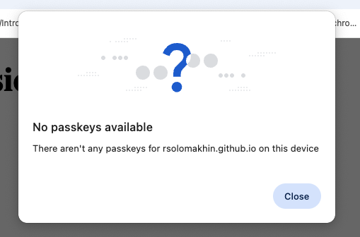
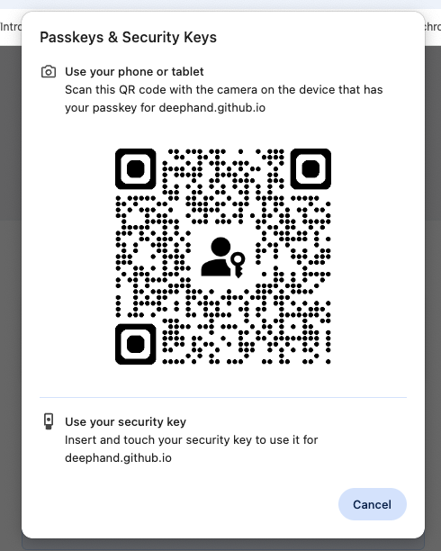
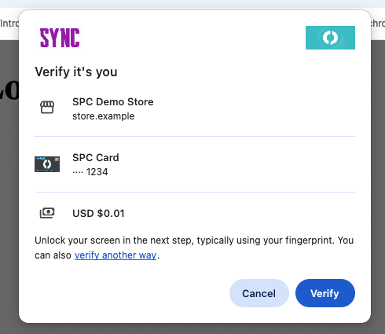
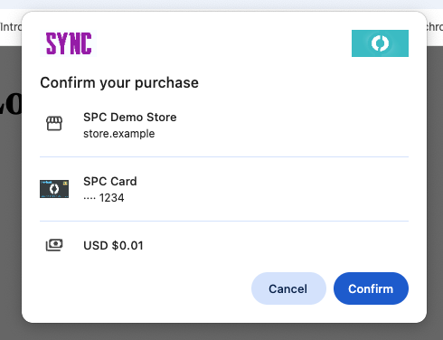
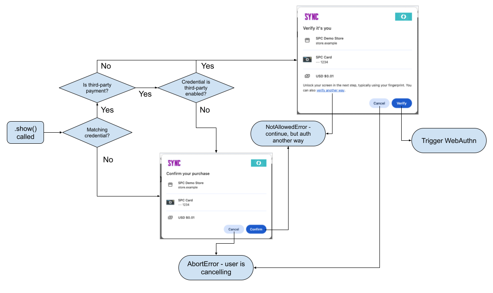

# Explainer: Non-queryable authenticators

## Author:

Stephen McGruer \<smcgruer@chromium.org\>

(With thanks to Nina Satragno and Darwin Yang)

## Status:

_Document state: **Proposal**_

_Last updated: 05-Aug-2026_

## Summary

Secure Payment Confirmation (SPC) currently relies on the browser's ability to
silently check for passkey existence before presenting transaction UX.  While
this prevents "cannot proceed" dead-end screens, it restricts SPC to **queryable
authenticators** (such as Google Password Manager or Windows Hello).  It
excludes **non-queryable authenticators**, including Android Credential Manager
(CredMan), Apple Passkeys, third-party passkey managers, and unconnected
security keys.

To expand SPC authenticator support without compromising user experience, this
explainer proposes two complementary specification changes:

1. **Prefer silently detectable passkeys while surfacing others in fallback
   UX**: Partition candidate credentials into *definitely available* and
   *potentially available*, enabling fallback UX to offer a "Use passkey" option
   when credentials cannot be queried upfront.

2. **Opt-in forced transaction UX (`alwaysShowTransactionDialog`)**: Allow
   calling websites to explicitly request showing the full transaction UX
   regardless of silent availability detection, catering to flows where users
   are expected to use roaming hardware keys or third-party providers.

## Background

A key goal when designing Secure Payment Confirmation was to avoid users
getting stuck in "cannot proceed" states. Such states are an unfortunate but
possible experience in WebAuthn, due to the combination of [their privacy
model](https://w3c.github.io/webauthn/#sctn-assertion-privacy) and the lack of
knowledge in the browser as to whether or not a credential actually exists:

1. To avoid silently leaking the existence/nonexistence of a passkey, WebAuthn
   must always show some form of UX and require user interaction, as otherwise
   a site could infer nonexistence via "API call failed near-immediately =>
   means there's no passkey".

2. Due to the existence of both roaming authenticators as well as "closed"
   platform authenticators (which do not allow the browser to silently query for
   credential existence), WebAuthn UX must assume that the user could proceed
   via various methods even if the browser cannot immediately determine passkey
   existence.

This combination leads to many UX screens in WebAuthn such as the following,
which are often confusing to users:

<table> 
  <tr valign="bottom"> 
    <td align="center"></td> 
    <td align="center"></td> 
  </tr> 
  <tr> 
    <td align="center"><sub>A 'no passkeys available' UX dialog, to preserve silently leaking the absence of a given passkey</sub></td> 
    <td align="center"><sub>A 'use another device' UX dialog. But what if I don't know where my passkey is - or if I have one at all?</sub></td> 
  </tr> 
</table>

### SPC's current solution to "cannot proceed" states

For SPC, a primary goal of the WPWG was to avoid "cannot proceed" states due to
the added friction (additional clicks) and user confusion, both of which are
likely to lead to conversion loss. To address this, the group designed and
evolved SPC to rely on three key concepts:

1. The ability for the browser to [silently check if a given passkey is
   available for the current
   device](https://w3c.github.io/secure-payment-confirmation/#steps-to-silently-determine-if-a-credential-is-available-for-the-current-device).

2. The ability for the browser to [silently check if a given passkey was
   third-party enabled for
   SPC](https://w3c.github.io/secure-payment-confirmation/#steps-to-silently-determine-if-an-spc-credential-is-third-party-enabled).

3. The "fallback transaction dialog", which allows a user to confirm their
   transaction details even if a passkey authentication is not then used to
   authenticate them:

<table> 
  <tr valign="bottom"> 
    <td align="center"></td> 
    <td align="center"></td> 
  </tr> 
  <tr> 
    <td colspan="2" align="center"><sub>The SPC transaction dialog, left, and fallback transaction dialog, right.<br/>The fallback is shown when no matching credentials are found for the current device.<br/>Both screenshots are from Chrome's implementation of SPC.
</sub></td> 
  </tr> 
</table>

The combination of these three concepts in theory allows us to avoid "cannot
proceed" states:

1. Upon SPC invocation, the browser silently checks if any of the input
   passkeys are available.

2. If some passkey is available, and this is a third-party SPC authentication
   (i.e., the calling website is not the Relying Party), the browser silently
   checks if any of the available passkeys have the third-party payment bit.

3. If both of the above pass, the browser shows the SPC transaction dialog.

    1. If the user clicks "Verify", the browser triggers WebAuthn
       authentication. There is a very high possibility that the user will be
       able to complete the flow on this device.

    2. If the user clicks "verify another way", a `NotAllowedError` is returned
       to the website which should be interpreted as "continue using a mechanism
       other than passkeys".

    3. If the user clicks Cancel, an `AbortError` is returned to the website
       which should be interpreted as "user wants to cancel payment".

4. If steps (1) or (2) failed, the browser shows the fallback transaction
   dialog.

    1. If the user clicks Confirm, a `NotAllowedError` is returned to the
       website which should be interpreted as "continue using a mechanism other
       than passkeys".

    2. If the user clicks Cancel, an `AbortError` is returned to the website
       which should be interpreted as "user wants to cancel payment".



### The problem(s) with SPC's solution

While the above mostly works to avoid "cannot proceed" states, it relies on
faulty assumptions:

**Assumption #1: The browser can always silently determine credential existence
for platform authenticators.**

This is only true for authenticators currently attached to the device that allow
silent credential discovery. These "**queryable authenticators**" include Google
Password Manager (GPM) (when accessed by Chrome via direct-API), Windows Hello,
or plugged-in USB security keys.

This is however not true for "**non-queryable authenticators**":

- Roaming authenticators that are not currently connected to the device.

- "Closed" platform authenticators, such as:

    - Authenticators accessed via CredMan on Android.
    - Apple passkeys on MacOS, unless the user has previously consented to
      silently discovering credentials.
    - Potentially, third-party passkey providers accessed via Windows Hello.

> [!NOTE]
> On Android, the Credential Manager (CredMan) layer intermediates the browser's
> access to passkeys, which means that the browser cannot talk directly to any
> individual authenticator. Features like WebAuthn's conditional mediation and
> immediate uiMode are all implemented via CredMan for browsers on Android.
> 
> At this time, CredMan has no specific support for SPC.

**Assumption #2: That platform authenticators support storing and silently
retrieving the third-party payment bit.**

In practice, this is supported only by GPM and Windows Hello (for the Windows
OS authenticator only). It may additionally be supported by some roaming
authenticators, if they support the FIDO thirdPartyPayment bit extension. Other
authenticators either do not support the third-party payment bit, or as noted
above do not support silent querying at all.

Of note, if a user were able to select an authenticator that did not support
the third-party payment bit when creating the credential, the bit is just lost.
The passkey is still created, but doesn't store the bit alongside it. (Even
worse, the RP isn't informed of this fact; see [issue
273](https://github.com/w3c/secure-payment-confirmation/issues/273)).

**Consequences**

Because SPC's current design relies on up-front silent querying, it excludes
unconnected or non-queryable authenticators, since neither credential existence
nor third-party payment support can be determined prior to prompting the user.

In practice, these problems have led to a minimal set of authenticators being
supported for SPC by user agents; see [Authenticators and
SPC](../explorations/authenticators-and-spc.md). For example, Chrome's
SPC implementation currently supports:

| Platform | Available authenticators (for Chrome) | Authenticators used for SPC by Chrome | Third-party payment bit storage |
| :---- | :---- | :---- | :---- |
| Android | GPM<br>Third-party Android apps (e.g., 1Password)<br>Security keys (via NFC, bluetooth, usb) | GPM (direct-API access, rather than via CredMan) | GPM |
| MacOS | Apple passkeys<br>GPM<br>Chrome-profile authenticator<br>Security keys (via NFC, bluetooth, usb) | Chrome-profile authenticator | Chrome-profile |
| Windows | Windows Hello (Windows authenticator)<br>Windows Hello (third-party apps)<br>GPM<br>Security keys (via NFC, bluetooth, usb) | Windows Hello (**but** not using their credential querying API\!) | Chrome-profile (unnecessary, as Windows Hello supports the bit) |

To support all authenticators - both connected/queryable and
unconnected/non-queryable - we must address these architectural limitations and
adapt SPC's design for each category.

## Proposal

I propose modifying SPC to accommodate the reality that the browser cannot
always know silently if a given passkey will be available or if it has the
third-party payment bit enabled, whilst still keeping the UX flow as optimal as
possible for the "happy path" case.

Two modifications are proposed:

1. Prefer silently detectable passkeys, but make others available in fallback UX.

2. Allow calling website to require always showing the verification dialog.

The former keeps SPC's current optimal UX flow, while providing an 'escape
hatch' for cases where a passkey cannot be silently detectable but the user
knows that they have one (e.g., if they have a security key that they can plug
in). The latter allows websites to opt into the full transaction UX all the
time, providing a clearer UX at the cost of potentially sending the user into a
"cannot proceed" state.

### Summary of UX Behaviors across Scenarios

| Authenticator / Credential State | Current SPC Behavior | Proposal 1 (Default) | Proposal 2 (`alwaysShowTransactionDialog: true`) |
| :--- | :--- | :--- | :--- |
| **Queryable passkey available on device** | Shows SPC Transaction UX | Shows SPC Transaction UX | Shows SPC Transaction UX |
| **Non-queryable passkey available (e.g., security key, Apple Passkey)** | Shows Fallback UX (Confirm/Cancel only) | Shows Fallback UX with "Use passkey for RP" option | Shows SPC Transaction UX |
| **No passkey exists anywhere** | Shows Fallback UX (Confirm/Cancel only) | Shows Fallback UX with "Use passkey for RP" (WebAuthn "cannot proceed" state if pressed) | Shows SPC Transaction UX → WebAuthn "cannot proceed" state |


### Prefer silently detectable passkeys; make others available in fallback UX

The idea here is to make it always possible for the user to indicate that they
want to use a passkey, **preferring** the case where the browser can detect
that automatically, but also giving users the ability to indicate that they
have a non-queryable authenticator that they want to use. For example, in
Chrome's 'fallback UX' dialog this ability might look like (engineering mock!):


Explicitly displaying the Relying Party identifier (e.g., `"Use passkey for
bank.example"`) in the fallback UX provides essential clarity in third-party
payment contexts, where the merchant origin invoking SPC differs from the
credential issuer.

How this would work at a specification level is a little nuanced, as
technically the specification does not have the concept of a "fallback dialog".
In the SPC specification, step 5 of [this
algorithm](https://w3c.github.io/secure-payment-confirmation/#sctn-steps-to-check-if-a-payment-can-be-made)
removes all credential IDs which fail the [steps to silently determine if a
credential is available for the current
device](https://w3c.github.io/secure-payment-confirmation/#steps-to-silently-determine-if-a-credential-is-available-for-the-current-device),
as well as the [steps to silently determine if an SPC Credential is third-party
enabled](https://w3c.github.io/secure-payment-confirmation/#steps-to-silently-determine-if-an-spc-credential-is-third-party-enabled)
in third-party cases.

For non-queryable authenticators (e.g., a roaming authenticator that is not
currently connected to the user's device), these steps will always fail and
reduce the credential list to empty. This then will fail in step 1 of [this
algorithm](https://w3c.github.io/secure-payment-confirmation/#sctn-steps-to-respond-to-a-payment-request),
causing the SPC call to reject with a `NotAllowedError` `DOMException`.

To address this, we need to separate out the clearing of passkeys which are
silently detected as available (and third-party enabled, when relevant), and
those which are not.

In the [steps to check if a payment can be
made](https://w3c.github.io/secure-payment-confirmation/#sctn-steps-to-check-if-a-payment-can-be-made),
we would replace the loop over `data["credentialIds"]` with the following (high
level description, actual specification steps would differ slightly):

1. Let `definitelyAvailableCredentials` be an empty list.

2. Let `potentiallyAvailableCredentials` be an empty list.

3. For each id in `data["credentialIds"]`:

    1. If the [steps to silently determine if a credential is available for the
       current device](https://w3c.github.io/secure-payment-confirmation/#steps-to-silently-determine-if-a-credential-is-available-for-the-current-device)
       return false, add the id to `potentiallyAvailableCredentials` and go to the
       next iteration.

    2. If this is not a third-party case, add the id to
       `definitelyAvailableCredentials` and go to the next iteration.

    3. Otherwise, if the [steps to silently determine if an SPC Credential is
       third-party
       enabled](https://w3c.github.io/secure-payment-confirmation/#steps-to-silently-determine-if-an-spc-credential-is-third-party-enabled)
       return true, add the id to `definitelyAvailableCredentials`.

4. If this is a third-party case, clear the `potentiallyAvailableCredentials` list.

> [!IMPORTANT]
>
> Step 4. is required to enforce the third-party payment bit protection. If we
> cannot query the credential silently, we cannot know whether or not the
> passkey (if it does exist) is third-party enabled.
>
> Alternatively, we could regress on the promise to never show `rp.com` in an
> SPC flow unless `rp.com` has set the third-party payment bit on their
> credentials. Instead we would only promise (of course!) that the browser will
> never return the signed cryptogram to the calling website if we find out
> **afterwards** that there's no third-party payment bit.

Then later in [Outcome of the transaction confirmation
UX](https://w3c.github.io/secure-payment-confirmation/#sctn-transaction-confirmation-outcome),
we would modify `data["credentialIds"]` based on the outcome:

- The user wishes to proceed with the payment, using an SPC Credential to authenticate,

    - Set `data["credentialIds"]` to `definitelyAvailableCredentials` if
      non-empty, otherwise `potentiallyAvailableCredentials`.

- The user wishes to proceed with the payment, but either cannot (if both
  `definitelyAvailableCredentials` and `potentiallyAvailableCredentials` are
  empty) or does not wish to use an SPC Credential,

    - Set `data["credentialIds"]` to an empty list.

- The user does not wish to proceed with the payment,

    - No change.

- The user wishes to opt out of the process for the given relying party,

    - No change.

These spec changes would allow user agents to build UX flows that give the user
the choice to use a passkey even if none have been found in queryable
authenticators, while still preferencing the queryable authenticators if
relevant. However, we expect it to be challenging to design a good UX in Chrome
that offers using a passkey to the user without that being confusing or
visually poor quality - this is an area we still need to explore more.

### Allow calling website to require always showing the verification dialog

As an additive approach to the above, we could enable the calling website to
indicate that the browser should **always** show the verification transaction
dialog, even if it was unable to silently match any of the credentials.

This would allow websites that want to support roaming authenticators to set
this mode, whilst having the default experience still be optimized for only
silently-detectable credentials.

In WebIDL:

```webidl
dictionary SecurePaymentConfirmationRequest {
    ...
    // New member, default false. Name to be bike-shedded later!
    boolean alwaysShowTransactionDialog = false;
};
```

(Alternatively, an enum member (e.g. `dialogMode = "default" |
"always-show-transaction-dialog"`) could be considered if future fallback
behaviors or authenticator requirements need to be specified beyond a boolean
flag).

If alwaysShowTransactionDialog is set to true, the browser would always show
the Transaction UX, and would always trigger WebAuthn afterwards (which might
then present UX to the user to plugin a security key, use their phone, etc).
The default would remain as false to align with current SPC behavior.

At a specification level, the `alwaysShowTransactionDialog` would simply be a
hint to the browser to optimize their UX flow, rather than have a normative
impact on the text (as, again, the SPC specification itself does not currently
have the concept of a "fallback dialog").

**Note**: As above, we would likely still need to remove any
`potentiallyAvailableCredentials` for the third-party case, so again there is
some limitation on this idea.
